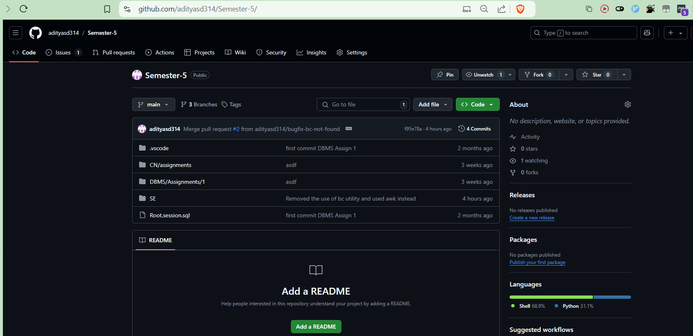
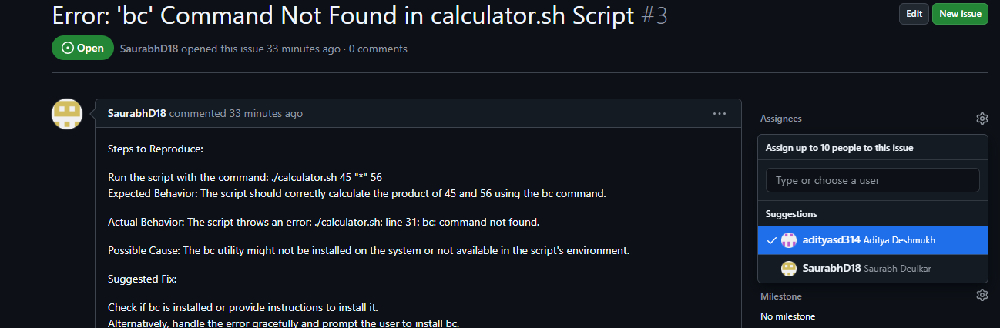
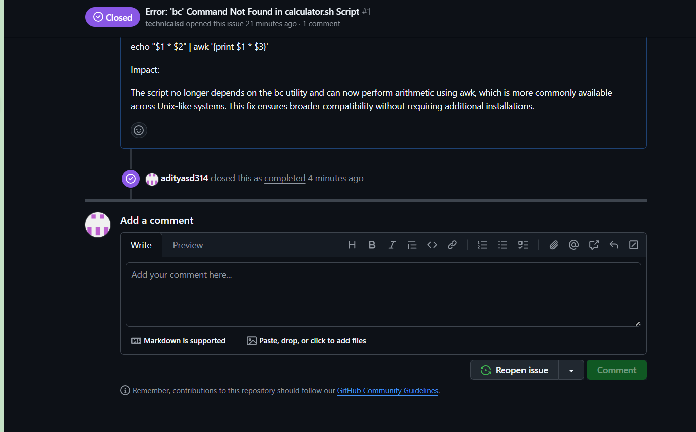
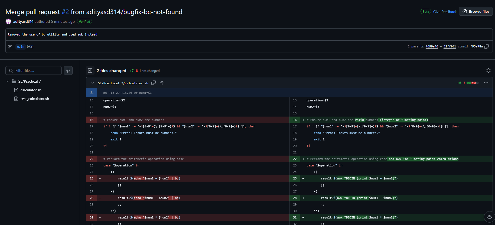
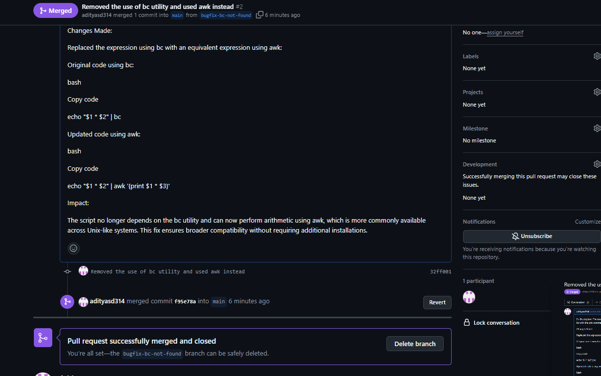

# Software Engineering Practical No. 8

## Overview

This repository contains all my lab work for Semester 5. The main goal of this practical is to demonstrate collaboration using Git by creating a remote repository, reporting bugs, assigning issues, fixing bugs, and managing pull requests.

**Repository Link:** [Semester 5 Lab Work Repository](https://github.com/adityasd314/semester-5/)

## Contributors

- **Aditya Deshmukh** (GitHub: [adityasd314](https://github.com/adityasd314))
- **Saurabh Deulkar** (GitHub: [technicalsd](https://github.com/technicalsd))

## Table of Contents

1\. [Introduction](#introduction)

2\. [Repository Setup](#repository-setup)

3\. [Collaborative Activities](#collaborative-activities)

   - [Reporting Bugs](#reporting-bugs)

   - [Assigning Issues](#assigning-issues)

   - [Fixing Bugs](#fixing-bugs)

   - [Using Git Branches](#using-git-branches)

   - [Pull Requests](#pull-requests)

4\. [Conclusion](#conclusion)

5\. [Images](#images)

## Introduction

In this practical, we collaborated as a group of two members to manage our software project effectively using Git. We created a remote repository, reported bugs, assigned issues to team members, and conducted various Git operations to enhance our development workflow.

## Repository Setup

1\. **Create a Remote Repository:**

   - We created a remote repository on GitHub to host all our lab work for Semester 5.

   - The repository was initialized with a `README.md` file.

    
2\. **Clone the Repository:**

   - Each member cloned the repository to their local machine using the command:

     ```bash

     git clone https://github.com/adityasd314/semester-5/

     ```

3\. **Project Files:**

   - The existing project files were added to the cloned repository folder, followed by staging and committing the changes.

   

## Collaborative Activities

### Reporting Bugs

- Saurabh Deulkar reported a bug related to the `bc` command in the `calculator.sh` script. The issue was titled:

  - **Issue Title:** Error: 'bc' Command Not Found in calculator.sh Script

  - **Description:** The script failed due to the absence of the `bc` command.

)

### Assigning Issues

- After the issue was reported, I (Aditya) assigned myself to fix the bug. This was done using the **Assignees** feature on GitHub.


### Fixing Bugs

- I created a new branch to address the issue:

  ```bash

  git checkout -b fix-bc-command

  ```

- I then modified the `calculator.sh` script to replace the usage of `bc` with `awk` for performing arithmetic operations. The original line:

  ```bash

  echo "$1 * $2" | bc

  ```

  was updated to:

  ```bash

  echo "$1 * $2" | awk '{print $1 * $3}'

  ```

- After making the changes, I committed them:

  ```bash

  git add calculator.sh

  git commit -m "Fix: Replace bc with awk for arithmetic operations"

  ```


### Using Git Branches

- After committing my changes, I pushed the new branch to the remote repository:

  ```bash

  git push origin fix-bc-command

  ```



### Pull Requests

- Once the changes were pushed, I created a pull request to merge my branch into the main branch. The pull request included a detailed description of the changes made and was reviewed before merging.





## Conclusion

Through this practical, we gained valuable experience in using Git for collaborative software development. We effectively managed bugs, issues, and changes in our project, enhancing our teamwork and version control skills.

## Images

- )

---

Feel free to insert any relevant images where indicated and customize further if necessary!
